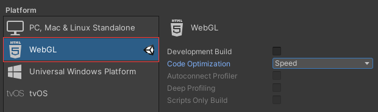
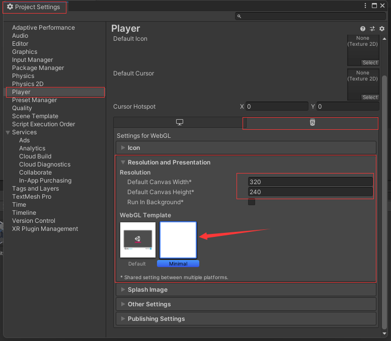
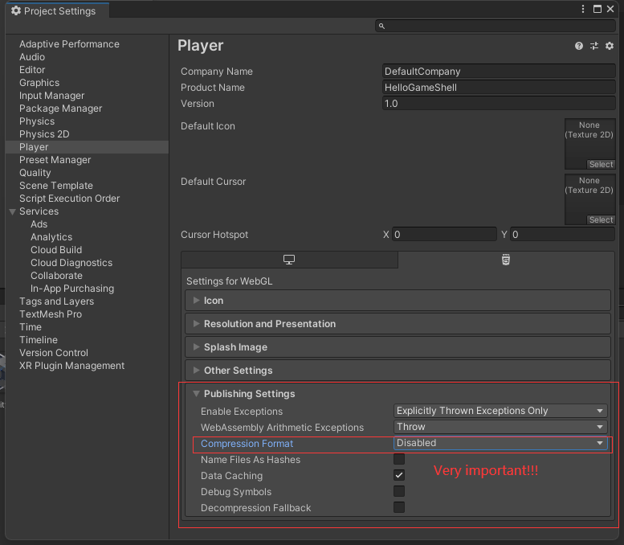

# GameShell Tips

Make sure the OS version of your GameShell is 0.5 or newer.

You have to build and install mesa 20.1 or newer.

Switch the GPU Driver of your GameShell to Lima if it's not.

## 1. Upgrade graphics

First check your mesa version:

```bash
DISPLAY=:0 glxinfo | grep "OpenGL version"
```

If it shows `OpenGL version string: 2.1 Mesa 20.0.0`, then you have to upgrade the graphics of your GameShell.

Following instructions are from https://github.com/zzxzzk115/GameShell-Scripts :

If your kernel version > 5.3.6 then you need to switch to kernel 5.3.6. This is the most stable one.

Upgrade graphics:

```bash
bash <(curl -s https://raw.githubusercontent.com/zzxzzk115/GameShell-Scripts/main/scripts/graphics/upgrade_graphics.sh)
```

如果你在中国大陆，请使用以下脚本：

```bash
bash <(curl -s https://raw.fastgit.org/zzxzzk115/GameShell-Scripts/main/scripts/graphics/upgrade_graphics_cn.sh)
```

Then you need to reboot your GameShell：

```bash
sudo reboot
```

## 2. Switch to WebGL project

`File->BuildSettings`



## 3. Setup Project Settings

`Edit->Project Settings`



Select 'Minimal' template.

## 4. Fix stuck 90% when loading

Unity WebGL use Brotli to compress files by default, it has a bug: stuck at 90% when loading a game.

So, we have to change the default settings:



## 5. Build

Build, and wait.

## 6. Upload to GameShell

Upload the built output folder to GameShell

## 7. Use NW-Unity to auto packing

```bash
# Install NW-Unity by pip.
sudo pip3 install nwunity

# Package your Unity WebGL files on GameShell.
nwunity -d "/path/to/UnityWebGLDir" -n "MyGame" -p GameShell
```

